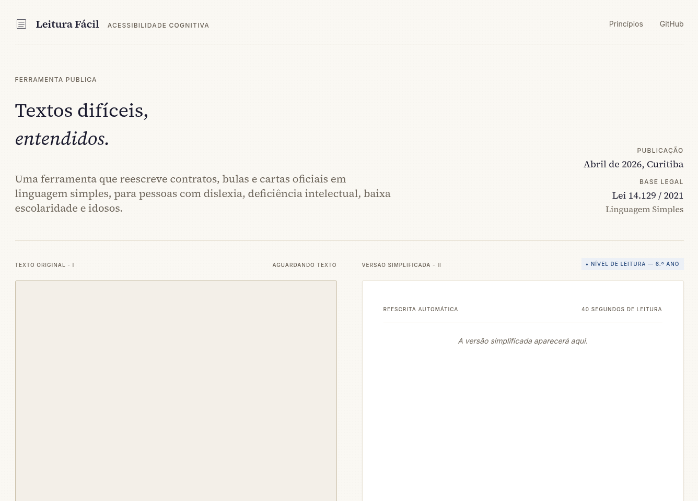

# Leitura Fácil

Uma ferramenta pública que reescreve documentos complexos em linguagem simples, calibrada por nível de leitura. Pensada para quem se sente excluído da própria papelada.

[](#stack-e-arquitetura)
[](#acessibilidade)
[](https://www.planalto.gov.br/ccivil_03/_ato2019-2022/2021/lei/L14129.htm)

---

## O problema

Mais da metade dos adultos brasileiros tem dificuldade para entender textos formais.[^analfabetismo] Contratos de aluguel, bulas de remédio, notificações da prefeitura, decisões judiciais e comunicados do INSS afetam decisões importantes da vida, mas são escritos numa linguagem que exclui boa parte de quem precisa entendê-los.

A consequência é silenciosa: pessoas assinam papéis que não compreendem, tomam remédios sem saber os efeitos colaterais e perdem prazos porque não conseguem decifrar cartas oficiais. **O problema não é cognitivo, é de redação.**

A **Lei nº 14.129/2021** tornou a linguagem simples um princípio do governo digital brasileiro. Mas a lei não escreve por ninguém, só abre o caminho. O Leitura Fácil ocupa esse caminho.

[^analfabetismo]: Indicador de Alfabetismo Funcional (INAF), Instituto Paulo Montenegro, 2018.

---

## A solução

Uma página simples, sem cadastro, sem armazenamento, sem ads. O usuário entrega o documento em um dos quatro formatos e recebe a versão simplificada no nível de leitura que escolheu.



### Os quatro caminhos de entrada

| Entrada | Caso de uso |
|---|---|
| **Texto colado** | Cópia direta de e-mails, mensagens, PDFs já abertos |
| **PDF anexado** | Contratos, manuais, documentos baixados |
| **Foto / imagem** | Documento físico fotografado pelo celular |
| **Link da web** | Notícias, decretos, artigos públicos online |

Todos convergem para o mesmo pipeline interno: o texto é extraído, exibido para o usuário revisar e então simplificado pela IA.

### Os onze níveis de leitura

Em vez de "simplifique mais" ou "simplifique menos", o usuário escolhe um nível concreto, do 1º ano ao Superior. A IA reescreve respeitando o vocabulário, o comprimento de frase e a complexidade sintática esperados para cada nível.

### Princípios editoriais

Quatro regras que a IA segue, e que ficam visíveis para o usuário:

- **Frases curtas**: no máximo 20 palavras
- **Voz ativa**: quem faz a ação aparece primeiro
- **Vocabulário comum**: palavras do dia a dia no lugar de termos técnicos
- **Leitura respirável**: espaço em branco como ferramenta

---

## Demonstração


---

## Stack e arquitetura

```
┌─────────────────────────────────────────┐
│           FRONTEND (Vite)               │
│  React 19 · TypeScript · Tailwind       │
│  Web Speech API · jsPDF · ReactMarkdown │
└──────────────┬──────────────────────────┘
               │ HTTPS
┌──────────────┴──────────────────────────┐
│           BACKEND (Node)                │
│  Express · TypeScript · Anthropic SDK   │
│  Multer · pdf-parse · JSDOM             │
│  Mozilla Readability · express-rate-limit│
└──────────────┬──────────────────────────┘
               │
        ┌──────┴──────┐
        ↓             ↓
   Anthropic        Web (URLs
   (Haiku 4.5)      externas)
```

### Por que essa stack

**React + TypeScript + Vite** no frontend porque o produto é uma SPA: uma única tela com fluxo único de interação. Vite oferece HMR rápido e build otimizado sem configuração. TypeScript ajuda a manter o projeto seguro e fácil de evoluir.

**Tailwind** porque o sistema de design "Editorial Calm" é coerente, mas customizado. Tailwind permite que cada componente carregue seu próprio estilo, sem a fragmentação de CSS-in-JS nem o peso de uma biblioteca de componentes prontos.

**Express** no backend porque a aplicação tem poucos endpoints e nenhum estado persistente. Frameworks maiores como NestJS ou Fastify seriam overhead injustificado.

**Anthropic Claude Haiku 4.5** como engine de simplificação. Foi escolhido por três motivos: qualidade da reescrita em português, suporte robusto a `tool use` (saída estruturada garantida via schema) e custo viável para uso público gratuito.

**Tool use no lugar de prompt engineering puro** porque garante saída JSON validada pelo esquema, sem regex frágil de parsing e sem alucinação de campos.

### Estrutura de pastas

```
/
├── api/                          # Backend
│   ├── src/
│   │   ├── routes/               # Endpoints HTTP
│   │   │   ├── simplify.ts       # POST /api/simplify
│   │   │   └── extract.ts        # POST /api/extract/{pdf,image,url}
│   │   ├── services/             # Lógica de negócio
│   │   │   ├── anthropic.ts      # Chamadas ao Claude
│   │   │   ├── pdf.ts            # Extração de texto de PDF
│   │   │   ├── image.ts          # Extração via Vision API
│   │   │   └── url.ts            # Fetch + Readability
│   │   ├── middlewares/
│   │   │   └── rateLimit.ts      # Limites por rota
│   │   ├── lib/
│   │   │   └── prompt.ts         # System prompts
│   │   ├── types/
│   │   ├── config.ts             # dotenv isolado
│   │   └── index.ts              # Bootstrap Express
│   ├── .npmrc                    # Defesas de supply chain
│   └── package.json
│
└── src/                          # Frontend
    ├── components/
    │   ├── ui/                   # Componentes atômicos
    │   │   ├── Button.tsx
    │   │   ├── Paragraph.tsx
    │   │   ├── ReadingScale.tsx  # Slider de 11 níveis
    │   │   └── ResponseBox.tsx
    │   ├── HeroSection.tsx
    │   ├── Form.tsx
    │   ├── Principles.tsx
    │   ├── Footer.tsx
    │   └── header.tsx
    ├── features/simplify/        # Hooks de lógica
    │   ├── useSimplify.ts
    │   ├── useExtractPdf.ts
    │   ├── extractImage.ts
    │   └── useExtractUrl.ts
    ├── hooks/
    │   └── useSpeechSynthesis.ts # Web Speech API
    ├── lib/
    │   └── exportPdf.ts          # Geração client-side de PDF
    └── services/
        └── api.ts                # Cliente HTTP
```

---

## Funcionalidades

### Entrada
- ✅ Colar texto direto
- ✅ Anexar PDF (até 10 MB)
- ✅ Anexar ou fotografar imagem (JPG, PNG, WEBP até 20 MB)
- ✅ Colar URL pública (HTTP/HTTPS)
- ✅ Câmera traseira em mobile via `capture="environment"`

### Processamento
- ✅ Onze níveis de leitura (1º ano até Superior)
- ✅ Detecção automática do tipo de documento
- ✅ Observação editorial calibrada ao nível
- ✅ Truncamento inteligente em 50.000 caracteres

### Saída
- ✅ Texto simplificado com formatação Markdown
- ✅ Leitura em voz alta (Web Speech API, voz nativa do SO)
- ✅ Cópia para área de transferência
- ✅ Download em PDF (geração client-side, fonte Helvetica para legibilidade)

### Acessibilidade
- ✅ Lighthouse Accessibility 100/100
- ✅ ARIA completo (live regions, landmarks, labels)
- ✅ Navegação 100% por teclado
- ✅ Foco automático no botão "Ouvir" após a simplificação
- ✅ Anúncio automático do resultado para leitores de tela

---

## Decisões de design

### Por que o PDF é gerado no frontend

A geração do PDF usa **jsPDF no navegador** em vez de Puppeteer no servidor. Os trade-offs:

- **Privacidade**: o texto simplificado nunca volta ao servidor para ser convertido em PDF. Isso reforça a promessa de que não armazenamos textos.
- **Custo**: zero carga no backend. Cada PDF é gerado pela máquina do próprio usuário.
- **Performance**: download imediato, sem espera de rede.
- **Limitação aceita**: os PDFs ficam mais simples, sem negrito inline nem renderização rica. Para o caso de uso, isso é suficiente.

### Por que Helvetica no PDF e Source Serif no site

O site usa **Source Serif 4** por coerência editorial. O PDF usa **Helvetica** por uma razão empírica: leitores com dislexia leem de 12% a 15% mais rápido em fontes sans-serif.[^dislexia] O público-alvo do Leitura Fácil tem alta sobreposição com dislexia, baixa visão e idade avançada. Para esses perfis, sans-serif vence.

[^dislexia]: Rello, Luz & Baeza-Yates, Ricardo. "Good fonts for dyslexia." ASSETS '13.

### Por que mostrar o texto extraído antes de simplificar

Quando o usuário anexa PDF, imagem ou URL, o texto extraído aparece no campo de texto **antes** da simplificação. Isso atende a três objetivos:

1. **Transparência**: o usuário vê o que a IA vai processar.
2. **Controle**: pode editar o texto antes, removendo trechos irrelevantes.
3. **Economia**: a simplificação só roda quando o usuário aprova, evitando chamadas desnecessárias à IA.

### Por que tool use no lugar de prompt + parse

Cada chamada à IA usa `tool use` com schema JSON definido. Isso elimina parsing frágil de saída e garante que os campos esperados sempre existam:

```typescript
{
    result: string,       // texto simplificado
    documentType: string, // ex: "Contrato de aluguel"
    register: string,     // ex: "4º ano · Fácil"
    editorNote: string    // observação editorial no nível do leitor
}
```

Se a IA não conseguir produzir o schema, retorna erro estruturado em vez de texto malformado.

---

## Acessibilidade

A acessibilidade do Leitura Fácil **não é apenas uma feature**. Ela é a tese do produto. Cada decisão foi tomada com isso em mente.

### Auditoria

- **Lighthouse Accessibility**: 100/100
- **WCAG 2.1**: Nível AA
- Testado com **Orca** (Linux, GNOME) e **DevTools Accessibility Tree**

### Implementação

- **Live regions** (`aria-live="polite"`) no resultado simplificado, para que leitores de tela anunciem a saída automaticamente
- **`aria-busy`** durante loading, evitando anúncios parciais
- **`role="alert"`** em mensagens de erro
- **Landmarks semânticos** (`<nav>`, `<section>`, `<footer>`) com `aria-label` distintos
- **Foco automático** no botão "Ouvir" quando a simplificação termina, encurtando o fluxo para usuários de teclado e leitor de tela
- **Web Speech API** para conversão texto→voz nativa do SO, sem dependência de API externa paga

---

## Segurança

A aplicação trata documentos que podem ser sensíveis, como contratos, dados pessoais e comunicações privadas. A segurança foi pensada em camadas.

### Rate limiting

Cada rota tem limite específico, proporcional ao custo computacional:

| Rota | Limite | Justificativa |
|---|---|---|
| Global | 100 req / 15min | Defesa geral |
| `/api/simplify` | 20 req / 15min | Chamada cara à IA |
| `/api/extract/*` | 30 req / 15min | Custo médio (Vision, fetch) |

### Proteção contra SSRF

A rota `/api/extract/url` valida cada hostname antes do fetch. IPs privados (RFC 1918), loopback, link-local (`169.254.169.254`, metadata service em cloud) e IPv6 internos são bloqueados após resolução DNS. A defesa cobre também DNS rebinding: verifica todos os IPs resolvidos, não apenas o primeiro.

### Defesa de supply chain

O `.npmrc` do backend configura:

- `ignore-scripts=true`: scripts de install não rodam, reduzindo um dos principais vetores de ataque em pacotes npm
- `min-release-age=7d`: pacotes recém-publicados não são instalados, dando tempo para a comunidade detectar possíveis comprometimentos

### Privacidade por design

- **Sem cadastro**: nenhuma identificação de usuário
- **Sem armazenamento**: textos enviados são processados em memória e descartados após a resposta
- **Sem analytics invasivo**: nenhum tracker de terceiros
- **HTTPS obrigatório em produção**: clipboard API e câmera só funcionam em contexto seguro

---

## Rodando localmente

### Pré-requisitos

- Node.js 20+
- Chave de API da Anthropic ([console.anthropic.com](https://console.anthropic.com))

### Passos

```bash
# Clone
git clone https://github.com/Carloslgp/EasyRead.git
cd EasyRead

# Backend
cd api
# crie um arquivo .env com ANTHROPIC_API_KEY e PORT (veja abaixo)
npm install
npm run dev    # http://localhost:3001

# Frontend (em outro terminal)
cd ..
# crie um arquivo .env com VITE_API_URL (veja abaixo)
npm install
npm run dev    # http://localhost:5173
```

### Variáveis de ambiente

**Backend (`api/.env`):**

```env
ANTHROPIC_API_KEY=sk-ant-...
PORT=3001
```

**Frontend (`.env`):**

```env
VITE_API_URL=http://localhost:3001
```

---

## Roadmap

### v1 (atual)
- ✅ Pipeline multimodal completo
- ✅ 11 níveis de leitura
- ✅ TTS + ARIA + acessibilidade plena
- ✅ Geração client-side de PDF
- ✅ Defesas de segurança em camadas

### v2 (planejado)
- 🔲 **Glossário inteligente**: identificação automática de termos difíceis no texto original, com tooltip contextual e silabação
- 🔲 **Exportação editorial**: PDF em formato A4 com tipografia refinada, EPUB para leitores de e-book
- 🔲 **Histórico local**: opção opt-in para salvar simplificações no localStorage do navegador

### v3 (visão)
- 🔲 **Extensão de navegador**: simplificar páginas web in-place
- 🔲 **Modo offline**: simplificação básica sem chamar API
- 🔲 **API pública**: para integração com outros projetos cívicos

---


> _"A clareza é uma forma de cortesia."_


Projeto de [Carlos](https://github.com/Carloslgp) · Curitiba, 2026