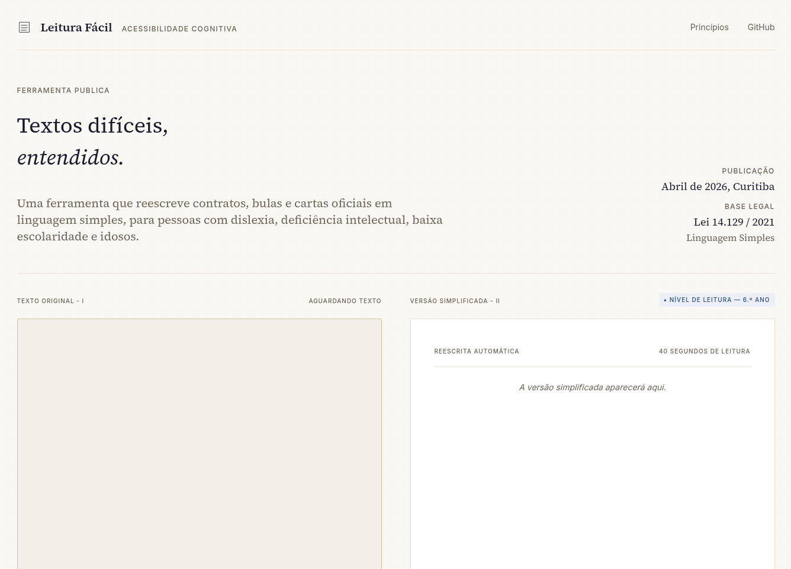

# Leitura Fácil (Easy Read)

A public tool that rewrites complex documents in plain language, calibrated by reading level. Built for people who feel shut out of their own paperwork.

[](#stack-and-architecture)
[](#accessibility)
[](https://www.planalto.gov.br/ccivil_03/_ato2019-2022/2021/lei/L14129.htm)

---

## The problem

More than half of Brazilian adults struggle to understand formal texts.[^literacy] Rental contracts, medication leaflets, city hall notices, court rulings and social security letters shape important life decisions, yet they are written in a language that excludes a large share of the people who need to understand them.

The consequence is quiet: people sign papers they don't understand, take medication without knowing the side effects, and miss deadlines because they can't decipher official letters. **The problem isn't cognitive, it's editorial.**

**Law No. 14,129/2021** made plain language a principle of Brazilian digital government. But a law doesn't write for anyone, it only clears the path. Leitura Fácil walks it.

[^literacy]: Functional Literacy Indicator (INAF), Instituto Paulo Montenegro, 2018.

---

## The solution

A simple page: no sign-up, no storage, no ads. The user submits a document in one of four formats and gets back a simplified version at the reading level they chose.



### The four input paths

| Input | Use case |
|---|---|
| **Pasted text** | Direct copy from emails, messages, PDFs already open |
| **Attached PDF** | Contracts, manuals, downloaded documents |
| **Photo / image** | Physical document photographed with a phone |
| **Web link** | News, decrees, public articles online |

All of them converge into the same internal pipeline: the text is extracted, shown to the user for review, and then simplified by the AI.

### The eleven reading levels

Instead of "simplify more" or "simplify less", the user picks a concrete level, from 1st grade to university. The AI rewrites the text respecting the vocabulary, sentence length and syntactic complexity expected at each level.

### Editorial principles

Four rules the AI follows, kept visible to the user:

- **Short sentences**: 20 words maximum
- **Active voice**: whoever performs the action comes first
- **Everyday vocabulary**: common words instead of technical terms
- **Breathable reading**: white space as a tool

---

## Demo


---

## Stack and architecture

```
┌─────────────────────────────────────────┐
│           FRONTEND (Vite)               │
│  React 19 · TypeScript · Tailwind       │
│  Web Speech API · jsPDF · ReactMarkdown │
└──────────────┬──────────────────────────┘
               │ HTTPS
┌──────────────┴──────────────────────────┐
│           BACKEND (Node)                │
│  Express · TypeScript · Anthropic SDK   │
│  Multer · pdf-parse · JSDOM             │
│  Mozilla Readability · express-rate-limit│
└──────────────┬──────────────────────────┘
               │
        ┌──────┴──────┐
        ↓             ↓
   Anthropic        Web (external
   (Haiku 4.5)        URLs)
```

### Why this stack

**React + TypeScript + Vite** on the frontend because the product is an SPA: a single screen with a single interaction flow. Vite gives fast HMR and an optimized build with no configuration. TypeScript keeps the project safe and easy to evolve.

**Tailwind** because the "Editorial Calm" design system is coherent but custom. Tailwind lets each component carry its own styling, without the fragmentation of CSS-in-JS or the weight of an off-the-shelf component library.

**Express** on the backend because the application has few endpoints and no persistent state. Larger frameworks like NestJS or Fastify would be unjustified overhead.

**Anthropic Claude Haiku 4.5** as the simplification engine. Chosen for three reasons: the quality of its rewriting in Portuguese, solid `tool use` support (structured output guaranteed by schema) and a cost that makes free public use viable.

**Tool use instead of pure prompt engineering** because it guarantees schema-validated JSON output, with no fragile parsing regex and no hallucinated fields.

### Folder structure

```
/
├── api/                          # Backend
│   ├── src/
│   │   ├── routes/               # HTTP endpoints
│   │   │   ├── simplify.ts       # POST /api/simplify
│   │   │   └── extract.ts        # POST /api/extract/{pdf,image,url}
│   │   ├── services/             # Business logic
│   │   │   ├── anthropic.ts      # Claude calls
│   │   │   ├── pdf.ts            # PDF text extraction
│   │   │   ├── image.ts          # Extraction via Vision API
│   │   │   └── url.ts            # Fetch + Readability
│   │   ├── middlewares/
│   │   │   └── rateLimit.ts      # Per-route limits
│   │   ├── lib/
│   │   │   └── prompt.ts         # System prompts
│   │   ├── types/
│   │   ├── config.ts             # Isolated dotenv
│   │   └── index.ts              # Express bootstrap
│   ├── .npmrc                    # Supply chain defenses
│   └── package.json
│
└── src/                          # Frontend
    ├── components/
    │   ├── ui/                   # Atomic components
    │   │   ├── Button.tsx
    │   │   ├── Paragraph.tsx
    │   │   ├── ReadingScale.tsx  # 11-level slider
    │   │   └── ResponseBox.tsx
    │   ├── HeroSection.tsx
    │   ├── Form.tsx
    │   ├── Principles.tsx
    │   ├── Footer.tsx
    │   └── header.tsx
    ├── features/simplify/        # Logic hooks
    │   ├── useSimplify.ts
    │   ├── useExtractPdf.ts
    │   ├── extractImage.ts
    │   └── useExtractUrl.ts
    ├── hooks/
    │   └── useSpeechSynthesis.ts # Web Speech API
    ├── lib/
    │   └── exportPdf.ts          # Client-side PDF generation
    └── services/
        └── api.ts                # HTTP client
```

---

## Features

### Input
- ✅ Paste text directly
- ✅ Attach a PDF (up to 10 MB)
- ✅ Attach or take a photo (JPG, PNG, WEBP up to 20 MB)
- ✅ Paste a public URL (HTTP/HTTPS)
- ✅ Rear camera on mobile via `capture="environment"`

### Processing
- ✅ Eleven reading levels (1st grade through university)
- ✅ Automatic document type detection
- ✅ Editorial note calibrated to the chosen level
- ✅ Smart truncation at 50,000 characters

### Output
- ✅ Simplified text with Markdown formatting
- ✅ Read aloud (Web Speech API, native OS voice)
- ✅ Copy to clipboard
- ✅ PDF download (generated client-side, Helvetica for legibility)

### Accessibility
- ✅ Lighthouse Accessibility 100/100
- ✅ Full ARIA (live regions, landmarks, labels)
- ✅ 100% keyboard navigation
- ✅ Automatic focus on the "Listen" button once simplification finishes
- ✅ Automatic announcement of the result to screen readers

---

## Design decisions

### Why the PDF is generated on the frontend

PDF generation uses **jsPDF in the browser** instead of Puppeteer on the server. The trade-offs:

- **Privacy**: the simplified text never goes back to the server to be converted into a PDF. This reinforces the promise that we don't store texts.
- **Cost**: zero backend load. Each PDF is generated on the user's own machine.
- **Performance**: immediate download, no network wait.
- **Accepted limitation**: the PDFs are simpler, with no inline bold or rich rendering. For this use case, that's enough.

### Why Helvetica in the PDF and Source Serif on the site

The site uses **Source Serif 4** for editorial coherence. The PDF uses **Helvetica** for an empirical reason: readers with dyslexia read 12% to 15% faster in sans-serif fonts.[^dyslexia] Leitura Fácil's audience overlaps heavily with dyslexia, low vision and old age. For those profiles, sans-serif wins.

[^dyslexia]: Rello, Luz & Baeza-Yates, Ricardo. "Good fonts for dyslexia." ASSETS '13.

### Why the extracted text is shown before simplification

When the user attaches a PDF, an image or a URL, the extracted text appears in the text field **before** simplification. This serves three goals:

1. **Transparency**: the user sees what the AI is about to process.
2. **Control**: they can edit the text first, removing irrelevant passages.
3. **Economy**: simplification only runs once the user approves, avoiding unnecessary AI calls.

### Why tool use instead of prompt + parse

Every AI call uses `tool use` with a defined JSON schema. This removes fragile output parsing and guarantees that the expected fields always exist:

```typescript
{
    result: string,       // simplified text
    documentType: string, // e.g. "Rental contract"
    register: string,     // e.g. "4th grade · Easy"
    editorNote: string    // editorial note at the reader's level
}
```

If the AI can't produce the schema, it returns a structured error instead of malformed text.

---

## Accessibility

Accessibility in Leitura Fácil **is not just a feature**. It's the product's thesis. Every decision was made with that in mind.

### Audit

- **Lighthouse Accessibility**: 100/100
- **WCAG 2.1**: Level AA
- Tested with **Orca** (Linux, GNOME) and the **DevTools Accessibility Tree**

### Implementation

- **Live regions** (`aria-live="polite"`) on the simplified result, so screen readers announce the output automatically
- **`aria-busy`** during loading, preventing partial announcements
- **`role="alert"`** on error messages
- **Semantic landmarks** (`<nav>`, `<section>`, `<footer>`) with distinct `aria-label`s
- **Automatic focus** on the "Listen" button when simplification finishes, shortening the flow for keyboard and screen reader users
- **Web Speech API** for native OS text-to-speech, with no dependency on a paid external API

---

## Security

The application handles documents that may be sensitive, such as contracts, personal data and private communications. Security was designed in layers.

### Rate limiting

Each route has its own limit, proportional to its computational cost:

| Route | Limit | Rationale |
|---|---|---|
| Global | 100 req / 15min | General defense |
| `/api/simplify` | 20 req / 15min | Expensive AI call |
| `/api/extract/*` | 30 req / 15min | Medium cost (Vision, fetch) |

### SSRF protection

The `/api/extract/url` route validates every hostname before fetching. Private IPs (RFC 1918), loopback, link-local (`169.254.169.254`, the cloud metadata service) and internal IPv6 are blocked after DNS resolution. The defense also covers DNS rebinding: it checks every resolved IP, not just the first one.

### Supply chain defense

The backend's `.npmrc` sets:

- `ignore-scripts=true`: install scripts don't run, reducing one of the main attack vectors in npm packages
- `min-release-age=7d`: freshly published packages aren't installed, giving the community time to catch possible compromises

### Privacy by design

- **No sign-up**: no user identification whatsoever
- **No storage**: submitted texts are processed in memory and discarded after the response
- **No invasive analytics**: no third-party trackers
- **HTTPS required in production**: the clipboard API and the camera only work in a secure context

---

## Running locally

### Prerequisites

- Node.js 20+
- An Anthropic API key ([console.anthropic.com](https://console.anthropic.com))

### Steps

```bash
# Clone
git clone https://github.com/Carloslgp/EasyRead.git
cd EasyRead

# Backend
cd api
# create a .env file with ANTHROPIC_API_KEY and PORT (see below)
npm install
npm run dev    # http://localhost:3001

# Frontend (in another terminal)
cd ..
# create a .env file with VITE_API_URL (see below)
npm install
npm run dev    # http://localhost:5173
```

### Environment variables

**Backend (`api/.env`):**

```env
ANTHROPIC_API_KEY=sk-ant-...
PORT=3001
```

**Frontend (`.env`):**

```env
VITE_API_URL=http://localhost:3001
```

---

## Roadmap

### v1 (current)
- ✅ Full multimodal pipeline
- ✅ 11 reading levels
- ✅ TTS + ARIA + full accessibility
- ✅ Client-side PDF generation
- ✅ Layered security defenses

### v2 (planned)
- 🔲 **Smart glossary**: automatic detection of difficult terms in the original text, with contextual tooltips and syllable breaks
- 🔲 **Editorial export**: A4 PDF with refined typography, EPUB for e-readers
- 🔲 **Local history**: opt-in option to save simplifications in the browser's localStorage

### v3 (vision)
- 🔲 **Browser extension**: simplify web pages in place
- 🔲 **Offline mode**: basic simplification without calling the API
- 🔲 **Public API**: for integration with other civic projects

---

> _"Clarity is a form of courtesy."_

A project by [Carlos](https://github.com/Carloslgp) · Curitiba, 2026
